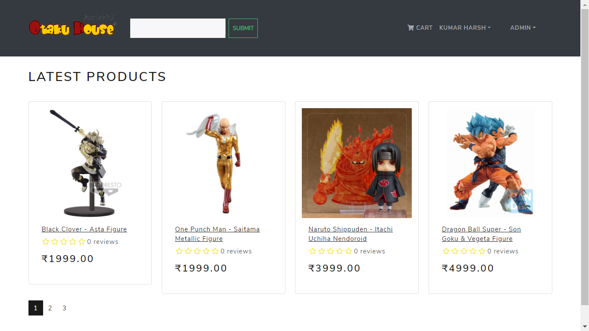
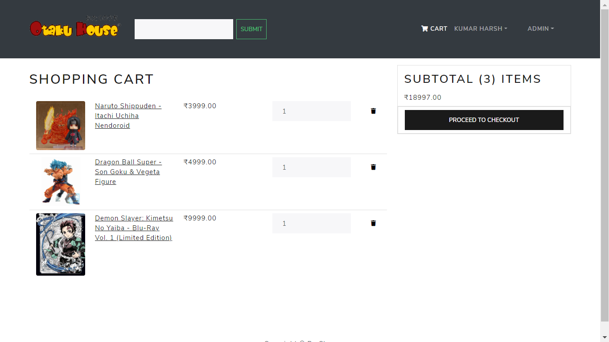
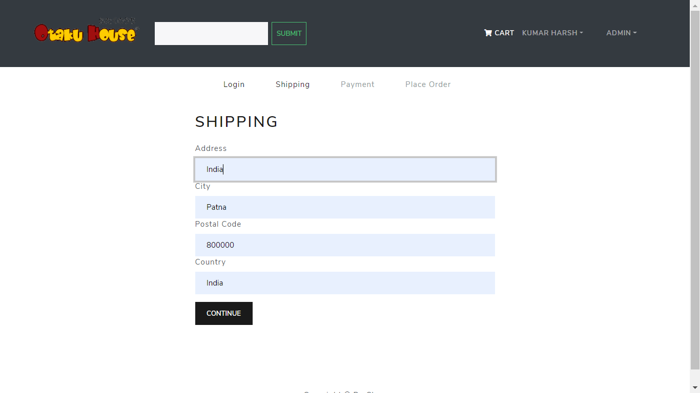
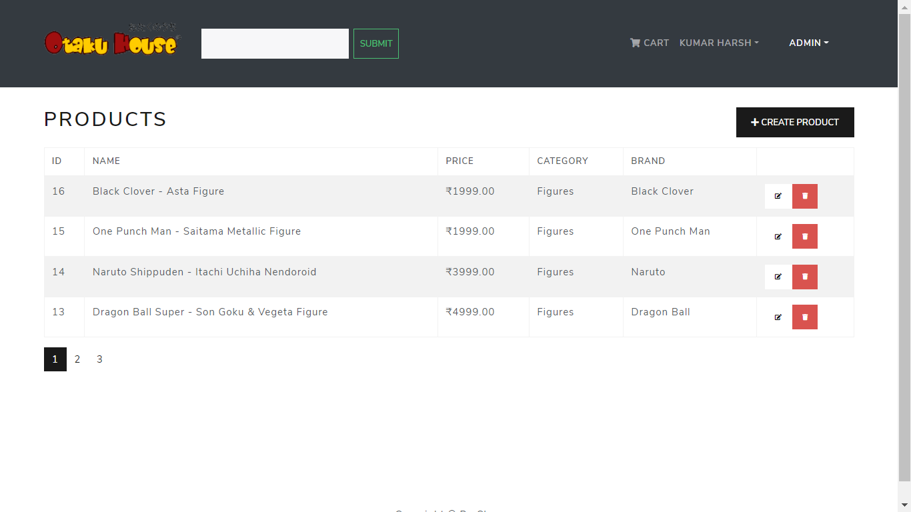
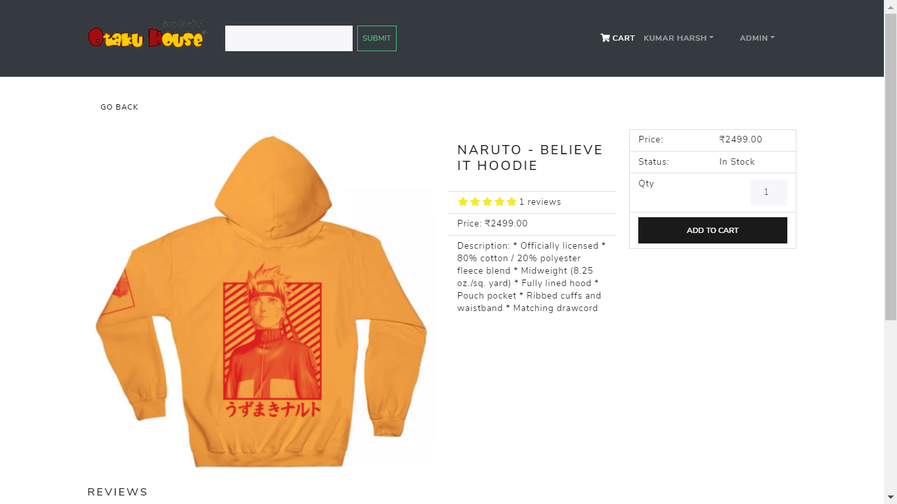

<h1 align=center>E-Commerce Website with Django + React & Redux</h1>
<h2 align=center>Otaku House - Anime Merchandise and Cosplay Shop</h2>

## [Live Link - Otaku House](https://otakuhouse.herokuapp.com/)

### How to Run 

```shell
1 Clone This Repo
2 cd backend
3 python -m venv env
4 .\env\Scripts\activate
5 pip install -r requirements.txt 
6 python manage.py runserver

```







